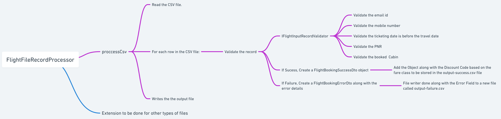
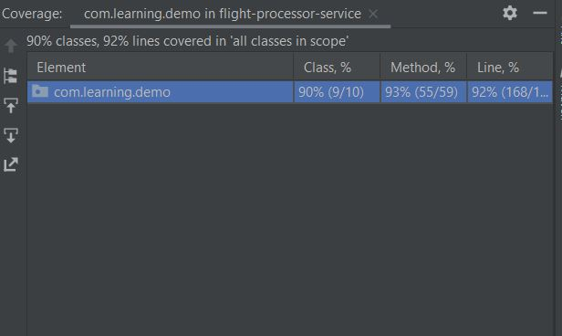

# Flight Booking Processor Service

 - A sample service to do the input output operation for the given PNR flight booking dat
 - The program basically segregates the file into two file one is output-success and output-failure so that the required 
 analyst can look into the data and do the necessary correction to the file.
 
## Technology used: OpenJdk 11, Maven 3.6.3, SOLID Design Principles
 
## High Level Design

 

## High Level Summary

 - This Java code defines a method called processCsv which takes three String parameters inputFile, successOutputFile, 
 and failureOutputFile, and may throw a FlightBookingException. 
 - The method reads a CSV file from the inputFile path and validates each record in it using a FlightInputRecordValidator. 
 - If a record is valid, it creates a FlightBookingSuccessDto object with the details and adds it to a list called outputLines. 
 - If it's invalid, it creates a FlightBookingErrorDto object with the details and adds it to a list called errorLines. 
 - It then writes these two lists to separate files at the successOutputFile and failureOutputFile paths using UTF-8 encoding. 
 - If the input file is empty, the method throws a FlightBookingException with an error message "No data in the file".
 

## Future Scope
 
  - The FlightFileProcessor Class can be extended to for processing other types of files,e.g: .xlx, .parquet, .json.
  - In the FlightInputRecordValidator class more validations can be provided as it is using Dependency inversion technique.
  - This is a simple maven project and can be converted to a server based on springboot server so large amount of data can be provided.

## Test Coverage attained is 92%

  